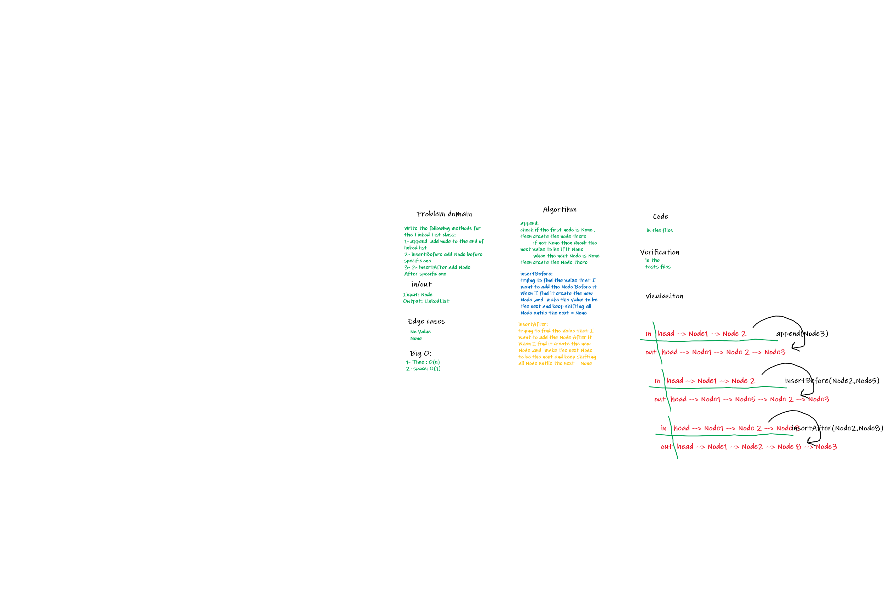

# Singly Linked List

The linked list is alternative to an array-based structure. A linked list is collection of nodes that collectively form linear sequence. In a singly linked list, each node stores a reference to an object that is an element of the sequence, as well as a reference to the next node of the list. It does not store any pointer or reference to the previous node. To store a single linked list, only the reference or pointer to the first node in that list must be stored. The last node in a single linked list points to nothing.

## Challenge

- Create a Node class that has properties for the value stored in the Node, and a pointer to the next Node. Within your - LinkedList class, include a head property. Upon instantiation, an empty Linked List should be created.

- Create methods in the LinkedList class :

- append(value) which adds a new node with the given value to the end of the list

- insertBefore(value, newVal) which add a new node with the given newValue immediately before the first value

- insertAfter(value, newVal) which add a new node with the given newValue immediately after the first value node

## Approach & Efficiency

- `space <- O(1)`
- `time <- O(n)`

## Solution

- `append(value) function` : which adds a new node with the given value to the end of the list

- `insertBefore(value, newVal) function` : which add a new node with the given newValue immediately before the first value

- `insertAfter(value, newVal) function` : which add a new node with the given newValue immediately after the first value node

## White Board

