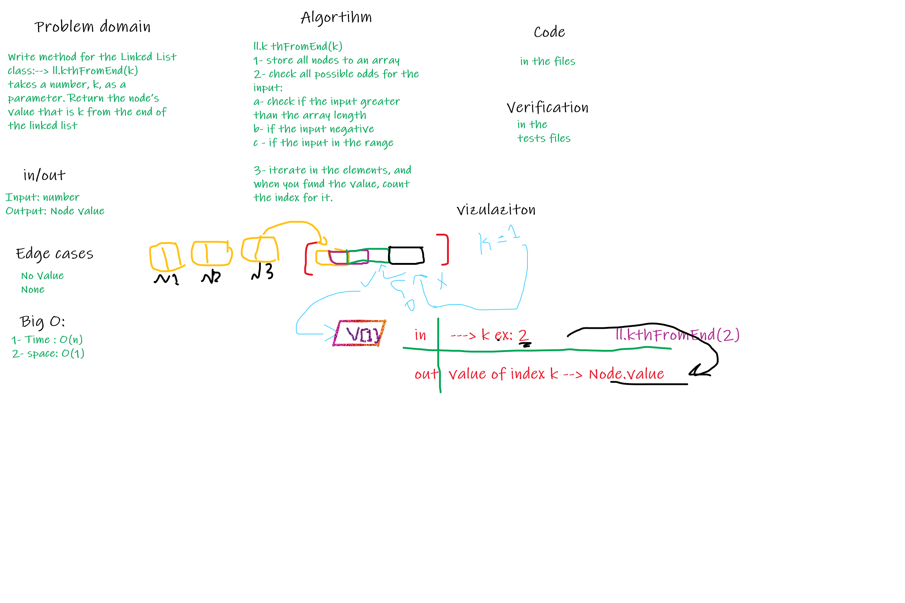

# Singly Linked List

The linked list is alternative to an array-based structure. A linked list is collection of nodes that collectively form linear sequence. In a singly linked list, each node stores a reference to an object that is an element of the sequence, as well as a reference to the next node of the list. It does not store any pointer or reference to the previous node. To store a single linked list, only the reference or pointer to the first node in that list must be stored. The last node in a single linked list points to nothing.

## Challenge

- Create a Node class that has properties for the value stored in the Node, and a pointer to the next Node. Within your - LinkedList class, include a head property. Upon instantiation, an empty Linked List should be created.

- Create methods in the LinkedList class :

- kth_from_end : takes a number, k, as a parameter. Return the node’s value that is k from the end of the linked list.

## Approach & Efficiency

`space <- O(1)`
`time <- O(n)`

## Solution

`kthFromEnd` a method for the Linked List class which takes a number, k, as a parameter. Return the node’s value that is k from the end of the linked list.

## Whiteboard

