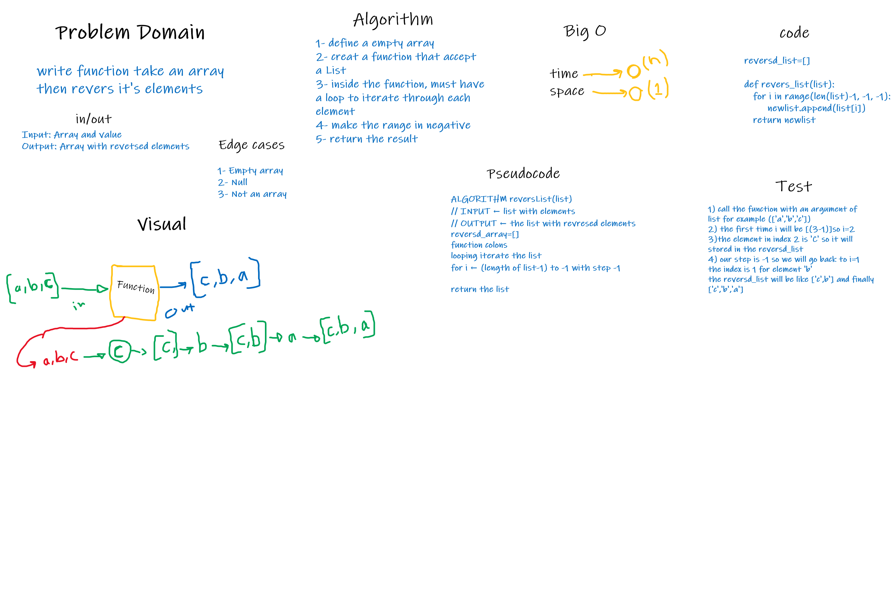

# Array-Reverse

Write a function called reverseArray which takes an array as an argument. Without utilizing any of the built-in methods available to your language, return an array with elements in reversed order.

## Approach & Efficiency

I create a function at the begging
then made a loop to iterate through each
element in backwords way (-1), and add each element to new array
big_O is used to analyze how functions scale with inputs of increasing size. big_O executes a Python function for input of increasing size N , and measures its execution time.
