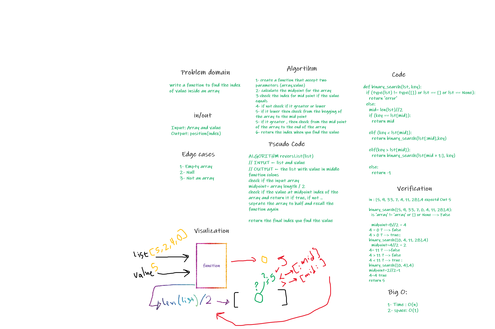

# Array-Reverse

write a function to find the indexof value inside an array

## Whiteboard Process

## Approach & Efficiency

I create a function at the begging it calculate the midpoint for the lentgh of the array
after that it trying to find the value inside it
big_O executes a Python function for input of increasing size N , and measures its execution time.
