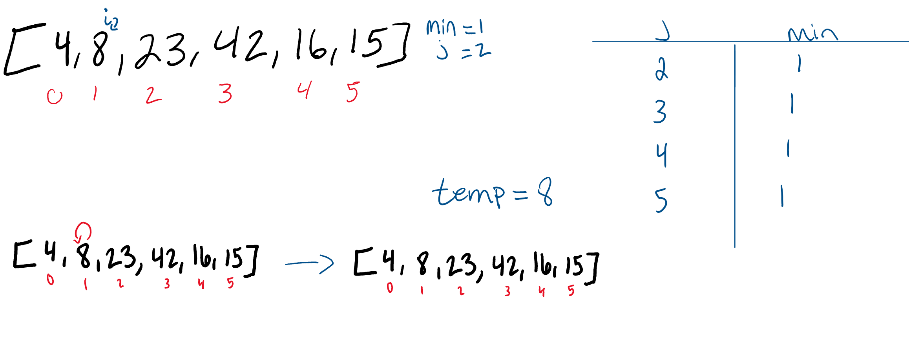

# Blog for Code Challenge 26 - Insertion Sort

## Description

Selection Sort is a sorting algorithm in the same family as bubble sort and selection sort but simpler and more efficient. Selection sort works by iterating across the array starting at the front and comparing if the value of the element next to it is lower. If the next door value is lower the elements change places.

### Pseudocode

```pseudocode
SelectionSort(int []arr)
    DECLARE n <-- arr.Length;
    FOR i = 0; i to n - 1
        DECLARE min <-- i;
        FOR j = i + 1 to n
            if (arr[j] < arr[min])
                min <-- j;

        DECLARE temp <-- arr[min];
        arr[min] <-- arr[i];
        arr[i] <-- temp;
```

### Python3 Implementation

```python3
def insertion_sort(array):
    for i in range(len(array)):
        j = i - 1
        temp = array[i]

        while j >= 0 and temp < array[j]:
            array[j + 1] = array[j]
            j = j - 1

        array[j + 1] = temp
```

## Trace

### Pass 1


We find this smaller number right away in index 1. The minimum value gets updated to remember this index. At the end of the evaluation, the smaller number will be swapped with the current value in index i. This results in our smallest number of our array being placed first.

### Pass 2



The second pass through the array evaluates the remaining values in the array to see if there is a smaller value other than the current position of i. 8 is the 2nd smallest number in the array, so it “swaps” with itself. The minimum value does not change at all during the iteration of this pass.

### Pass 3


The third pass through evaluates the remaining indexes in the array, starting at position 2. Both position 4 and 5 are smaller than the value in position 2. Each time a smaller number than the current minimum is found, the variable will update to the new smallest number. In this case, 15 is the next smallest number. As a result, it will swap with position 2.

### Pass 4


The 4th pass through on the array proves that 16 is the next smallest number in the array, and as a result, switches places with the 42.

### Pass 5


The 5th pass through of the array only has one other index to evaluate. Since the last index value is larger than index 4, the two values will swap.

### Pass 6


On its final iteratation through the array, it will swap places with itself as it evaluates the value against itself.

After this iteration, i will increment to 6, forcing it to break out of the outer for loop and leaving our array now sorted.
