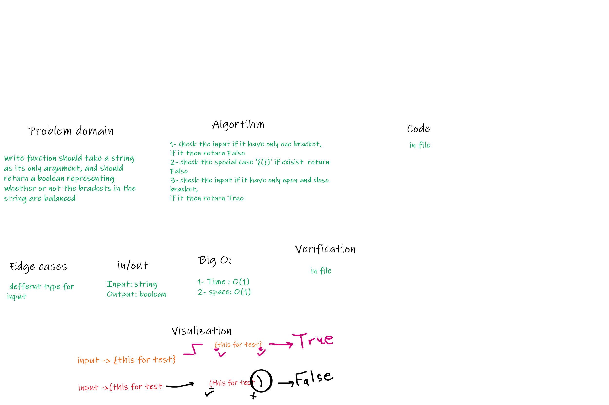

# Multi Bracket Validation

- Your function should take a string as its only argument, and should return a boolean representing whether or not the brackets in the string are balanced. There are 3 types of brackets: {} [] ()

- Given a string containing just the characters '(', ')', '{', '}', '[' and ']', determine if the input string is valid.

- An input string is valid if:

- Open brackets must be closed by the same type of brackets. Open brackets must be closed in the correct order. Note that an empty string is also considered valid.

## Challenge

write function should take a string as its only argument, and should return a boolean representing whether or not the brackets in the string are balanced

## White Board

