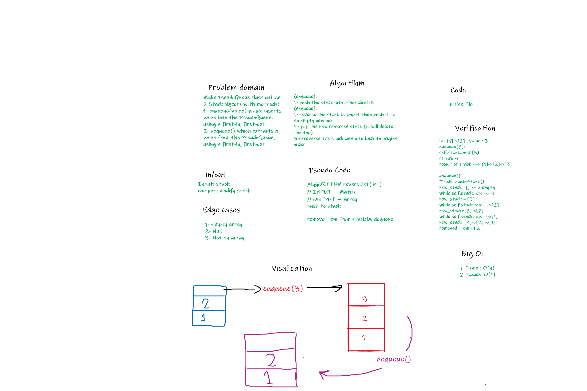

# Queues with Stacks

Make a queue data structure interface made with two stack data structure instances.

## Challenge

- Write queue interface methods enqueue and dequeue.
- `enqueue(value)` which inserts value into the PseudoQueue, using a first-in, first-out approach.
- `dequeue()` which extracts a value from the PseudoQueue, using a first-in, first-out approach.

## Approach & Efficiency

- To enqueue a value to the pseudo queue all values are popped into a second stack, the value is pushed to the top of the second stack and then all values are popped from the second stack back into the first stack. To dequeue a value from the pseudo queue the top of the first stack is popped off.

## API

The Pseudo Queue instance methods are enqueue which takes a value to add to the front of the queue and dequeue which removes a value from the front of the queue.

## White Board

