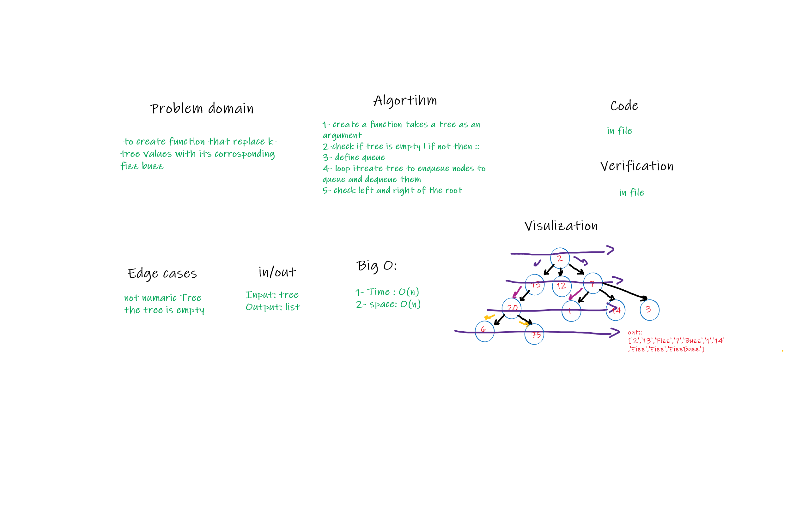

# Challenge Summary

- to create function that replace k-tree values with its corrosponding fizz buzz

## Whiteboard Process

## Approach & Efficiency

- time O(n)
- space O(n)

## Solution

function that take a and return also tree but in its corrosponiding fizz buzz values
